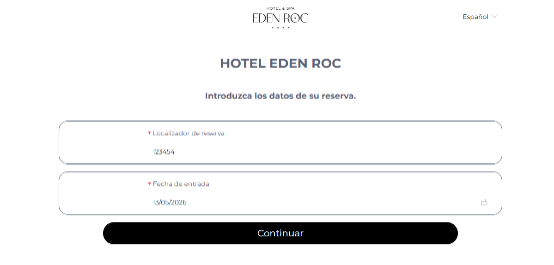
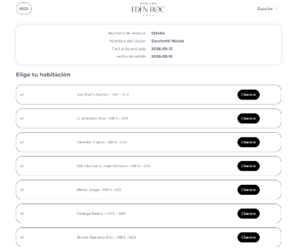
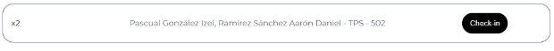
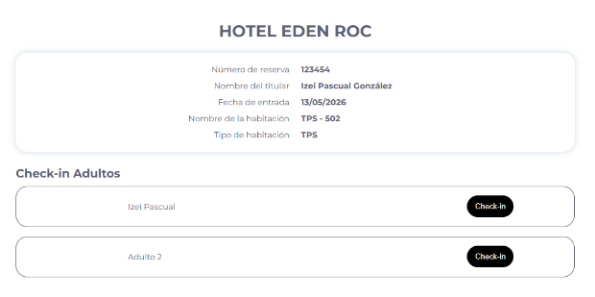
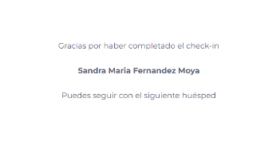

[Home](index.md) | [Program](program.md) | [Abstracts](abstracts.md) | [Registration](registration.md) | [Practical information](practical.md) | [Organizing committee](organizing.md)

# Location

The workshop will take place at the very nice
[Hotel Eden Roc, Sant Feliu de Guixols, Spain](https://www.edenrochotel.com/en/).
On-line check-in details, see below.

[Map of Sant Feliu and hotel](https://maps.app.goo.gl/eF8sv1zthqdXXNrX9).

# How to reach the conference location ?

The closest airports are [Barcelona](https://www.flightconnections.com/flights-from-barcelona-bcn) (116kms, 1h22 by car, 2h by bus) 
and [Girona](https://www.flightconnections.com/flights-from-barcelona-girona-gro) (30kms, 30 min by car, 45 min by bus) ones.
You can find useful flights through the links above to [flightconnections.com](https://www.flightconnections.com).

There are regular buses connecting both airports to Sant Feliu.
From the bus station to the hotel it's a 10 minutes walk . 

We will organize a shuttle from/to Barcelona airport, with intended departure from Barcelona airport on Monday 8 June at 11:00, and from the hotel on Thursday 11 June at 14:30.

More information about the bus (maps, links) to come ...

# Other questions ?

Contact <a href="mailto:abidev2026@abinit.org">abidev2026@abinit.org</a>.

# On-line check-in details

To speed up the registration process upon your arrival at Hotel Eden Roc, the hotel kindly asks you to complete the online check-in in advance.
This procedure must be done one time in case you have the standard 8-11 June stay, but also a second (possibly a third time) if you have additional nights.

Access the check-in portal: Click on the following [link](https://checkin.civitfun.com/hotel/hotel-eden-roc/bookingSearchForm).

You get a screen like the following.

Enter the reservation details (to be used for the 8-11 June conference):

   - Booking ID / Locator: 131725        
   - Arrival Date: 08/06/2026

For the additional nights, after making the check-in for the standard 8-11 June stay, reenter the form with the Booking ID that you have received for these additional nights. 
For additional dates before the conference, enter you real arrival date. 
For additional dates after the conference, enter 11/06/2026. 
If you have additional nights both before and after the conference, you will have to check-in twice with the same Booking ID, 
first with the true arrival date, then with the 11/06/2026 arrival date (not very convenient...).

Then, click "Continue". The system may take a few seconds to retrieve the data. For the 8-11 June conference Booking ID, you get the following screen, with a list of all participants. Please disregard the "Holder's Name" (the system automatically selects the first name on the list); simply scroll down until you find your own name. 

Once you find your name, click "Check-in" twice.

Important note for shared rooms: If you are sharing a room, you will see two entries under the same room. Once the first person completes their check-in, one entry will disappear or be labeled as "Adult 2".
The second person must select this entry to fill in their details (please refer to the next image for a visual guide).

Then follow the instructions to upload your documentation. It is expeditive to capture the recto and verso of your ID card (instead of entering the data by hand), especially if you have to do the check-in procedure twice or three times.

Finalize: After filling in all required fields, you get a page with where you can accept the terms and conditions, and other information,
that you should consult, also you might be asked to sign (this is a pad, use the mouse to "sign" the best you can), and click "Continue". 

Wait a few seconds until the confirmation message appears

Redo this procedure as many time you need to check-in for the additional stay before the conference, the conference, and for the additional stay after the conference.
