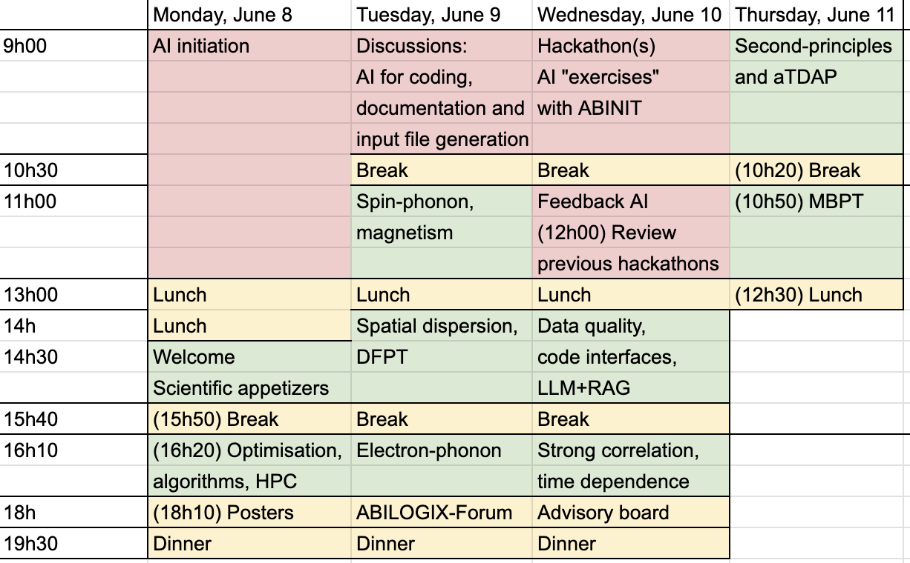

[Home](index.md) | [Program](program.md) | [Abstracts](abstracts.md) | [Registration](registration.md) | [Practical information](practical.md) | [Organizing committee](organizing.md)

# Program

_Every oral presentation is followed by some time for discussion, at least 5 minutes.  
Invited talks are 25 minutes + 5 minutes discussion, while other contributed talks are 15 minutes + 5 minutes discussion.
All scientific activities take place in the `Salon Mediterraneo'._

## Monday 8/6

- 9:00-13:00 Self and/or collective initiation to AI for coding and documentation, for those who are already present in Sant Feliu. Also, preliminary discussions about AI. Possibly already start to work on ABINIT as exercise.

- 11:00 Shuttle leaving from BCN airport to Hotel. Pick-up at T1 arrival area - from flight VY8001 / Iberia IB5183 (Paris‑Orly → Barcelona).

13:00 LUNCH

### Welcome and scientific appetizers 

Chair: Michel Coté

- 14:30-14:35 Max Stengel - _Workshop opening_
- 14:35-14:45 Xavier Gonze - _ABINIT project overview, introduction to the workshop_ ([abstract](abstracts.md#Gonze))
- 14:50-15:05 Augustin Blanchet - _Thermal exchange-correlation functionals_ ([abstract](abstracts.md#Blanchet))
- 15:10-15:25 Samuel Poncé - _In search of the electron-phonon contribution to total energy_ ([abstract](abstracts.md#Poncé))
- 15:30-15:45 Lorien McEnulty - _The PseudoDojo web interface_ ([abstract](abstracts.md#MacEnulty))

15:50 COFFEE BREAK

### Optimisation, algorithms, HPC - LLM+RAG evaluation 

Chair: Massimiliano Stengel

- 16:20-16:45 Alberto García (**invited**) - _Perspectives on Siesta development within the MaX project_ ([abstract](abstracts.md#García))
- 16:50-17:05 Lucas Baguet - _Abinit ground-state performances on CPUs_ ([abstract](abstracts.md#Baguet))
- 17:10-17:25 Marc Torrent - _ABINIT on GPU + Spectrum slicing algorithm_ ([abstract](abstracts.md#Torrent))
- 17:30-17:45 Clementine Barat - _Preconditioning Magnetic systems in ABINIT_ ([abstract](abstracts.md#Barat))
- 17:50-18:05 Aldo Romero - _ABINIT Q&A — LLM & RAG Evaluation: Topic Classification, Prompting Strategies, and Agentic Retrieval_ ([abstract](abstracts.md#Romero))^M

18:10-19:30 **Poster session** - ([List & abstracts](abstracts.md#Posters))

19:30 DINNER

## Tuesday 9/6

9:00-10:30 **Discussions**  
Chair: Matthieu Verstraete  
AI for coding, for documentation and input file generation).  
Some experience sharing, by Matteo Giantomassi and He Xu (and others?).

10:30 COFFEE BREAK

### Spin-phonon, magnetism

Chair: Matteo Calandra

- 11:00-11:25 Miquel Royo (**invited**) - _Linear response of magnets from constrained DFPT_ ([abstract](abstracts.md#Royo))
- 11:30-11:45 Rubén Garcia Llorente - _Magnon-phonon dynamics in the vdW magnet CrSBr from first principles_ ([abstract](abstracts.md#Llorente))
- 11:50-12:05 Samare Rostami - _Combined magnetic and structural transition state in first-principles calculations_ ([abstract](abstracts.md#Rostami))
- 12:10-12:25 Le Shu - _Generalized Bloch Theorem for Spin Spirals_ ([abstract](abstracts.md#Shu))
- 12:30-12:45 Josef Zwanziger - _NMR Features: Relativistic Terms, Spin Couplings, Spatial Maps_ ([abstract](abstracts.md#Zwanziger))

13:00 LUNCH

### Spatial dispersion properties and DFPT  

Chair: Matthieu Verstraete

- 14:00-14:25 Ivo Souza (**invited**) - _Optical spatial dispersion via Wannier interpolation_ ([abstract](abstracts.md#Souza))
- 14:30-14:45 Asier Zabalo - _Natural optical activity with SOC at transparent frequencies_ ([abstract](abstracts.md#Zabalo))
- 14:50-15:05 Chiara Fiorazzo - _Vibrational natural optical activity in crystals_ ([abstract](abstracts.md#Fiorazzo))
- 15:10-15:35 Gustau Catalan (**invited**) - _About flexoelectricity in conducting and/or polar materials preconceptions_ ([abstract](abstracts.md#Catalan))

15:40 COFFEE BREAK

### Electron-phonon

Chair: Ivo Souza

- 16:10-16:35 Matteo Calandra (**invited**) - _Ultrafast Phase Transitions from the Femtosecond to the Picosecond Scale_ ([abstract](abstracts.md#Buonaura))
- 16:40-16:55 Vasili Vasilchenko - _Variational approach to self-trapped polarons and hopping transport_ ([abstract](abstracts.md#Vasilchenko))
- 17:00-17:15 Matteo Giantomassi - _Electron-phonon coupling using GW perturbation theory_ ([abstract](abstracts.md#Giantomassi))
- 17:20-17:35 He Xu - _To be defined_ ([abstract](abstracts.md#He))
- 17:40-17:55 Guillaume Allemand - _Boltzmann Transport Equation for (magneto-) thermoelectric transport_ ([abstract](abstracts.md#Allemand))

### ABILOGIX - Forum

Chair: Philippe Ghosez

- 18:00-19:00 ABILOGIX presentation on gitlab migration: He Xu, Matteo Giantomassi  and Xavier Gonze ([slides](Slides_June_08_Tuesday/Gonze_ABINIT_Migration_v3.pdf)). 
- 19:00-19:15 Forum including renewal of moderators. 
- 19:15-19:30 Election of a new developer representative to ABILOGIX. 

19:30 DINNER

## Wednesday 10/6

9:00-10:30 **Hackathon(s)**  
Chair: Matthieu Verstraete, Marc Torrent  
AI "exercises" with ABINIT

10:30 COFFEE BREAK

11:00-12:00 **Feedback**  
Chair: Miquel Royo  
About AI, for coding, for documentation and input file generation

12:00-13:00 **Review previous hackathons**  
Chair: Marc Torrent  
Discuss new hackathons (also beautifications ?)

13:00 LUNCH

### Data quality - code interfaces - LLM+RAG evaluation. 

Chair: Alberto Garcia

- 14:30-14:55 Claudia Draxl (**invited**) - _Data quality assessment through benchmarking and ML_ ([abstract](abstracts.md#Draxl))
- 15:00-15:15 Guglielmo Marchese - _EPIq - A Wannier interpolator willing to interface with ABINIT_ ([abstract](abstracts.md#Marchese))
- 15:20-15:35 Aldo Romero and Gian-Marco Rignanese - _Analysis of the poll about LLM and RAG_ 

15:40 COFFEE BREAK

### Strong correlations and time-dependence 

Chair: Fabien Bruneval

- 16:10-16:35 Emilio Artacho (**invited**) - _Electron dynamics in solids - from electronic stopping to quantum kicks_ ([abstract](abstracts.md#Artacho))
- 16:40-16:55 Fabien Brieuc - _Advances regarding real-time TDDFT_ ([abstract](abstracts.md#Brieuc))
- 17:00-17:15 Frederic Gendron - _DMFT in ABINIT: Recent advances and applications_ ([abstract](abstracts.md#Gendron))
- 17:20-17:35 Mauricio Rodriguez - _NOFT, an efficient approach for strongly-correlated systems_ ([abstract](abstracts.md#Mayorga))
- 17:40-17:55 Olivier Gingras - _Strong correlations in ABINIT: Interface to triqs_modest_ ([abstract](abstracts.md#Gingras))

18:00-19:30 Advisory board meeting (only for advisory board members)

19:30 DINNER

## Thursday 11/6

### Second principles and TDEP

Chair: Emilio Artacho

- 9:00-9:15 Gabriel Antonius - _Recent developments in aTDEP_ ([abstract](abstracts.md#Antonius))
- 9:20-9:35 Louis Bastogne - _2nd-Principles Models in MULTIBINIT: Availability and Applications_ ([abstract](abstracts.md#Bastogne))
- 9:40-9:55 Fernando Gomez - _Time-dependent and spatially inhomogeneous electric fields in MULTIBINIT_ ([abstract](abstracts.md#Ortiz))
- 10:00-10:15 Romuald Béjaud - _Machine Learning Assisted Sampling Package_ ([abstract](abstracts.md#Béjaud))

10:20 COFFEE BREAK

### Many Body Perturbation Theory

Chair: Claudia Draxl

- 10:50-11:05 Hsiao-Yi Tsai - _Cubic scaling spinor GW in real space and imaginary time_ ([abstract](abstracts.md#Tsai))
- 11:10-11:25 James Boust - _Relaxed core PAW / Finite-temperature GWR_ ([abstract](abstracts.md#Boust))
- 11:30-11:45 Christian Tantardini - _Frequency-free dynamical-screening BSE_ ([abstract](abstracts.md#Tantardini))
	
11:50-12:20 **Discussions**  
Continued about AI or beautifications)

12:20-12:30 **Wrap up and final remarks**

12:30 LUNCH (Note the unusual time - other lunches are at 13:00)

13:30 Shuttle leaving to Barcelona (Sants station around 15:45, airport around 16:15)

